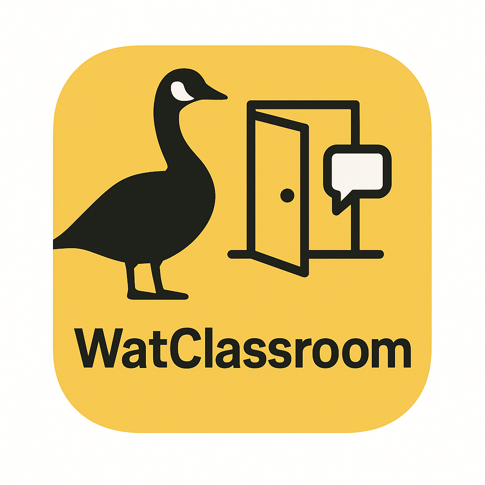

## Problem
Different people study best in different places. For some, it may be the comfort of the apartment, for others it might be the silence of the libraries. But for me and my friends, it is the empty classrooms. It is not too difficult to get a classroom, but in exam season, classrooms always seem full. 

Is there a way to ensure that we always get an empty class? We must decide **WAT CLASSROOM**?. 

## Solution
Presenting to you WatClassroom, an app where user inputs their location on campus, gets nearest empty classrooms which are currently empty. 

## API Documentation
https://openapi.data.uwaterloo.ca/api-docs/index.html

## Note
Please read the below before use. 

https://uwaterloo.ca/secretariat/policies-procedures-guidelines/policies/policy-46-information-management
